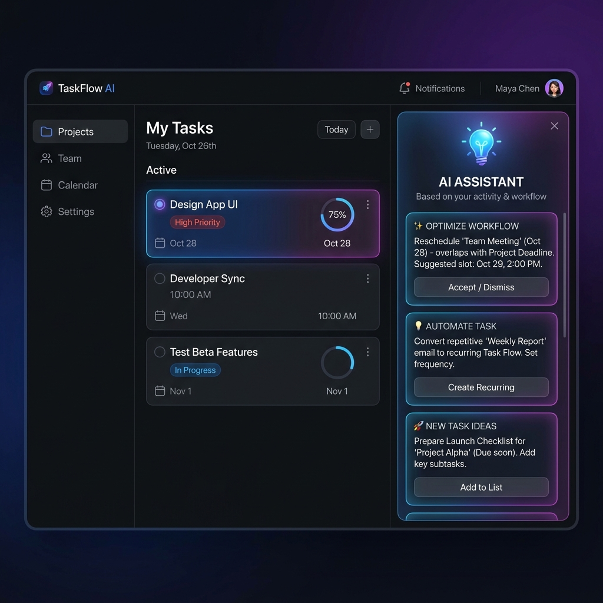
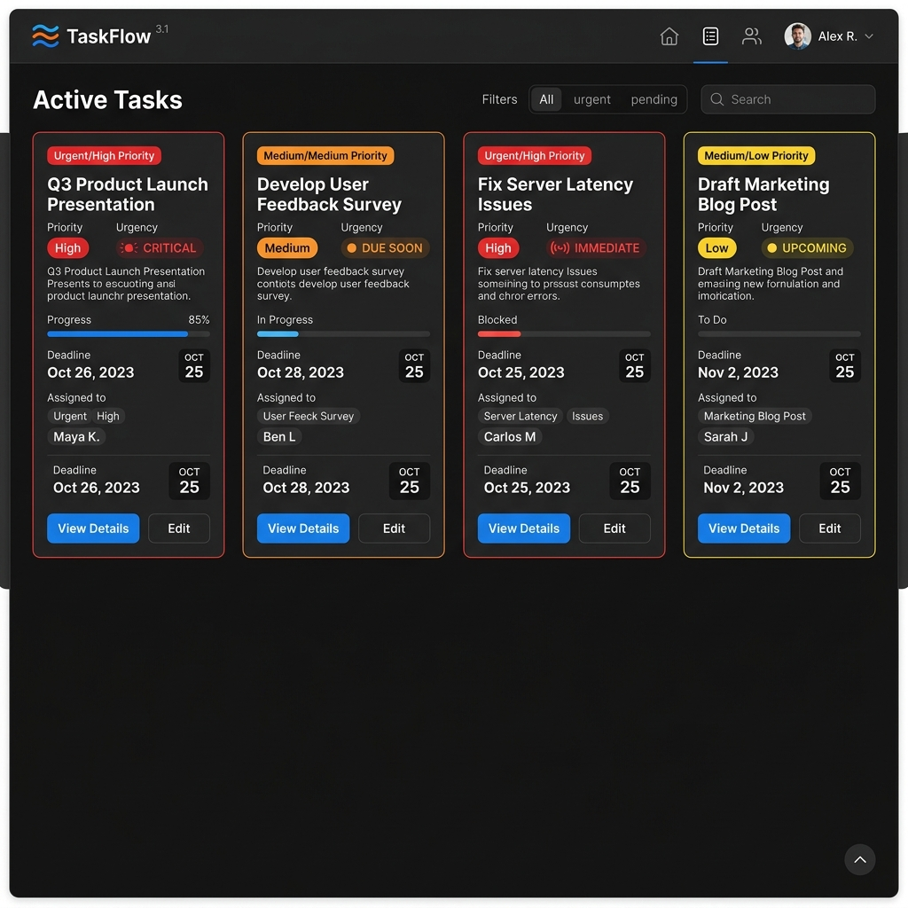

<<<<<<< HEAD
# 🚀 Smart AI Task Manager
=======
# TaskIQ 🚀
>>>>>>> 3a80ed8 (feat: overhaul dark mode aesthetics, custom dropdowns, advanced interaction design, and update README with TaskIQ branding)
=======
# DekNek Smart AI Task Manager 🚀
> Elevate your productivity with AI-driven task intelligence and a seamless SaaS-grade experience.
>>>>>>> aac0c53 (feat: overhaul dark mode aesthetics, custom dropdowns, advanced interaction design, and update README with TaskIQ branding)

> Smart AI-powered task management for modern productivity.

TaskIQ is a full-stack, AI-powered task management application designed to help users organize, prioritize, and complete tasks efficiently. Built with a modern React + Redux architecture and a scalable Node.js backend, TaskIQ delivers a seamless SaaS-like experience.

Powered by Google Gemini AI, TaskIQ provides intelligent task suggestions while leveraging advanced frontend techniques like optimistic UI updates, infinite scrolling, and debounced search for lightning-fast performance. With built-in deadline intelligence, real-time feedback, and accessibility-focused design, TaskIQ reflects production-grade engineering and UX standards.

---

## 🌐 Live Demo

<<<<<<< HEAD
Smart AI Task Manager is a modern, full-stack web application designed to help users manage tasks efficiently with the power of AI. It provides a clean SaaS-style interface, secure authentication, and intelligent task suggestions.

---

## 🌟 Features

* 🔐 Secure User Authentication (JWT-based login/signup)
* 🧠 AI-Powered Task Suggestions & Summaries
* 📊 Interactive Dashboard with Analytics
* ✅ Create, Update, Delete Tasks
* ⏰ Task Priorities & Deadlines
* 🔍 Search & Filter Tasks
* 🌙 Dark/Light Mode Toggle
* 📱 Fully Responsive Design

---

## 🛠️ Tech Stack

### Frontend

* React.js
* Redux Toolkit
* Tailwind CSS
* Framer Motion

### Backend

* Node.js
* Express.js
* JWT Authentication
* RESTful APIs

### Database

* MongoDB (Mongoose)

### AI Integration

* OpenAI API

---

## 🏗️ Architecture

* Follows MVC (Model-View-Controller) pattern
* Scalable and modular folder structure
* Separation of frontend and backend

---

## 📂 Project Structure

```
client/        # React frontend
server/        # Node.js backend
models/        # Database schemas
routes/        # API routes
controllers/   # Business logic
```

---

## 🔐 Authentication Flow

* User signup with encrypted passwords (bcrypt)
* Secure login using JWT tokens
* Protected routes with middleware
* Persistent login sessions

---

## ⚙️ Setup Instructions

### 1️⃣ Clone the Repository

```bash
git clone https://github.com/Sunil0987654321/Smart-AI-Task-Manager.git
cd Smart-AI-Task-Manager
```

### 2️⃣ Install Dependencies

```bash
cd client && npm install
cd ../server && npm install
```

### 3️⃣ Environment Variables

Create a `.env` file inside `/server`:

```
PORT=5000
MONGO_URI=your_mongodb_connection
JWT_SECRET=your_secret_key
OPENAI_API_KEY=your_api_key
```

### 4️⃣ Run the Application

```bash
# Run backend
cd server
npm run dev

# Run frontend
cd client
npm start
```

---

## 🚀 Deployment

* Frontend: Vercel / Netlify
* Backend: Render / Railway
* Database: MongoDB Atlas
=======
👉 **[Coming Soon! 🚀](#)**
>>>>>>> 3a80ed8 (feat: overhaul dark mode aesthetics, custom dropdowns, advanced interaction design, and update README with TaskIQ branding)

---

## 📸 Screenshots

<<<<<<< HEAD
(Add your UI screenshots here — dashboard, login page, AI feature, etc.)
=======
| Dashboard | AI Suggestions | Task Intelligence |
| :---: | :---: | :---: |
|  |  |  |

---

## ✨ Features (SaaS-Grade)

* 🤖 **Google Gemini AI Integration**: Intelligent task recommendations based on your workflow.
* ⚡ **Optimistic UI Updates**: Instant UI feedback for status changes and deletions.
* ⚠️ **Deadline Intelligence**: Overdue tasks pulse red, “Due Soon” tasks highlight in orange.
* 🔍 **Advanced Real-time Search**: Debounced search (300ms) with filtering (Priority, Status).
* 📂 **Persistent State**: Filters and preferences stored in LocalStorage.
* 🚀 **Infinite Scroll**: Smooth rendering using Intersection Observer.
* 🔔 **Resilient Notifications**: Toast notifications + network error handling.

---

## 🧠 Why This Project Stands Out

* AI-powered task planning using Google Gemini
* Production-level frontend architecture (Redux normalization, memoization)
* Advanced UX patterns (debounce, infinite scroll, optimistic UI)
* Robust error handling with Axios interceptors

---

## 🛠️ Advanced Engineering Highlights

* **Normalized Redux Architecture** (`byId`, `allIds`)
* **Performance Optimization** (`useMemo`, `React.memo`)
* **Global Axios Interceptors** for centralized error handling
* **AbortController** for request cancellation
* **Accessibility (A11y)** with ARIA labels & focus states

---

## 🏗️ Tech Stack

### Frontend

* React 18 (Vite)
* Redux Toolkit
* Tailwind CSS
* Framer Motion
* Lucide React
* React Hot Toast

### Backend

* Node.js / Express
* MongoDB (Mongoose)
* Google Gemini API
* JWT Authentication

---

## 📂 Project Structure

```text
code/
├── client/
│   ├── src/
│   │   ├── app/
│   │   ├── features/
│   │   ├── components/
│   │   ├── pages/
│   │   ├── services/
│   │   └── hooks/
├── server/
│   ├── src/
│   │   ├── controllers/
│   │   ├── models/
│   │   ├── routes/
│   │   └── middleware/
```

---

## 🚀 Getting Started

### 1. Clone Repository

```bash
git clone https://github.com/Sunil0987654321/Smart-AI-Task-Manager.git
cd Smart-AI-Task-Manager
```

---

### 2. Backend Setup

```bash
cd code/server
npm install
```

Create a `.env` file:

```env
PORT=5000
MONGO_URI=your_mongodb_uri
JWT_SECRET=your_secret
GEMINI_API_KEY=your_gemini_api_key
```

---

### 3. Frontend Setup

```bash
cd ../client
npm install
```

Create a `.env` file:

```env
VITE_API_URL=http://localhost:5000/api
```

---

## ▶️ Run the App

### Backend

```bash
cd code/server
npm run dev
```

### Frontend

```bash
cd code/client
npm run dev
```

---

## ☁️ Deployment

* Frontend: Vercel
* Backend: Render
* Database: MongoDB Atlas
>>>>>>> 3a80ed8 (feat: overhaul dark mode aesthetics, custom dropdowns, advanced interaction design, and update README with TaskIQ branding)

---

## 💡 Future Enhancements

<<<<<<< HEAD
* 🧑‍🤝‍🧑 Team collaboration features
* 📅 Calendar integration
* 📈 Advanced analytics
* 📱 Mobile app version

---

## 🤝 Contributing

Contributions are welcome! Feel free to fork this repository and submit a pull request.

---

## 📜 License

This project is licensed under the MIT License.

---

## ⭐ Show Your Support

If you like this project, give it a ⭐ on GitHub!
=======
<<<<<<< HEAD
=======
=======
# TaskIQ 🚀

> Smart AI-powered task management for modern productivity.

TaskIQ is a full-stack, AI-powered task management application designed to help users organize, prioritize, and complete tasks efficiently. Built with a modern React + Redux architecture and a scalable Node.js backend, TaskIQ delivers a seamless SaaS-like experience.

Powered by Google Gemini AI, TaskIQ provides intelligent task suggestions while leveraging advanced frontend techniques like optimistic UI updates, infinite scrolling, and debounced search for lightning-fast performance. With built-in deadline intelligence, real-time feedback, and accessibility-focused design, TaskIQ reflects production-grade engineering and UX standards.

---

## 🌐 Live Demo

👉 **[Coming Soon! 🚀](#)**

---

## 📸 Screenshots

>>>>>>> 3a80ed8 (feat: overhaul dark mode aesthetics, custom dropdowns, advanced interaction design, and update README with TaskIQ branding)
| Dashboard | AI Suggestions | Task Intelligence |
| :---: | :---: | :---: |
|  |  |  |

---

## ✨ Features (SaaS-Grade)

* 🤖 **Google Gemini AI Integration**: Intelligent task recommendations based on your workflow.
* ⚡ **Optimistic UI Updates**: Instant UI feedback for status changes and deletions.
* ⚠️ **Deadline Intelligence**: Overdue tasks pulse red, “Due Soon” tasks highlight in orange.
* 🔍 **Advanced Real-time Search**: Debounced search (300ms) with filtering (Priority, Status).
* 📂 **Persistent State**: Filters and preferences stored in LocalStorage.
* 🚀 **Infinite Scroll**: Smooth rendering using Intersection Observer.
* 🔔 **Resilient Notifications**: Toast notifications + network error handling.

---

## 🧠 Why This Project Stands Out

* AI-powered task planning using Google Gemini
* Production-level frontend architecture (Redux normalization, memoization)
* Advanced UX patterns (debounce, infinite scroll, optimistic UI)
* Robust error handling with Axios interceptors

---

## 🛠️ Advanced Engineering Highlights

* **Normalized Redux Architecture** (`byId`, `allIds`)
* **Performance Optimization** (`useMemo`, `React.memo`)
* **Global Axios Interceptors** for centralized error handling
* **AbortController** for request cancellation
* **Accessibility (A11y)** with ARIA labels & focus states

---

## 🏗️ Tech Stack

### Frontend

* React 18 (Vite)
* Redux Toolkit
* Tailwind CSS
* Framer Motion
* Lucide React
* React Hot Toast

### Backend

* Node.js / Express
* MongoDB (Mongoose)
* Google Gemini API
* JWT Authentication

---

## 📂 Project Structure

```text
code/
├── client/
│   ├── src/
│   │   ├── app/
│   │   ├── features/
│   │   ├── components/
│   │   ├── pages/
│   │   ├── services/
│   │   └── hooks/
├── server/
│   ├── src/
│   │   ├── controllers/
│   │   ├── models/
│   │   ├── routes/
│   │   └── middleware/
```

---

## 🚀 Getting Started

### 1. Clone Repository

```bash
git clone https://github.com/Sunil0987654321/Smart-AI-Task-Manager.git
cd Smart-AI-Task-Manager
```

---

### 2. Backend Setup

```bash
cd code/server
npm install
```

Create a `.env` file:

```env
PORT=5000
MONGO_URI=your_mongodb_uri
JWT_SECRET=your_secret
GEMINI_API_KEY=your_gemini_api_key
```

---

### 3. Frontend Setup

```bash
cd ../client
npm install
```

Create a `.env` file:

```env
VITE_API_URL=http://localhost:5000/api
```

---

## ▶️ Run the App

### Backend

```bash
cd code/server
npm run dev
```

### Frontend

```bash
cd code/client
npm run dev
```

---

## ☁️ Deployment

* Frontend: Vercel
* Backend: Render
* Database: MongoDB Atlas

---

## 💡 Future Enhancements

>>>>>>> aac0c53 (feat: overhaul dark mode aesthetics, custom dropdowns, advanced interaction design, and update README with TaskIQ branding)
* 🧑‍🤝‍🧑 **Team collaboration features**
* 📅 **Calendar integration**
* 📈 **Advanced analytics**
* 📱 **Mobile app version**

---

## 👨‍💻 Author

**Sunil Patturi**

* GitHub: [https://github.com/Sunil0987654321](https://github.com/Sunil0987654321)
* LinkedIn: [https://www.linkedin.com/in/sunil-kumar-patturi-13118828a/](https://www.linkedin.com/in/sunil-kumar-patturi-13118828a/)

---

## 📄 License

<<<<<<< HEAD
=======
<<<<<<< HEAD
This project is licensed under the MIT License - see the [LICENSE](LICENSE) file for details.
=======
>>>>>>> aac0c53 (feat: overhaul dark mode aesthetics, custom dropdowns, advanced interaction design, and update README with TaskIQ branding)
This project is licensed under the MIT License.
>>>>>>> 3a80ed8 (feat: overhaul dark mode aesthetics, custom dropdowns, advanced interaction design, and update README with TaskIQ branding)
